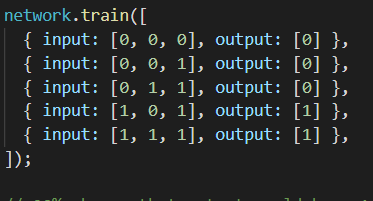
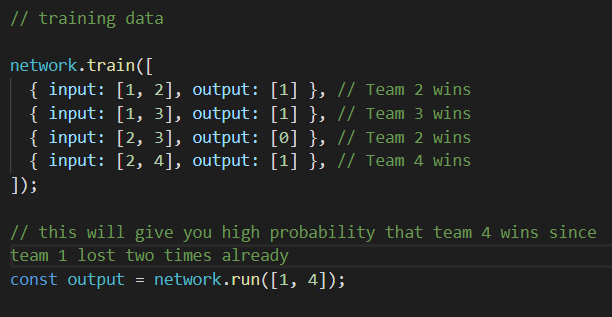
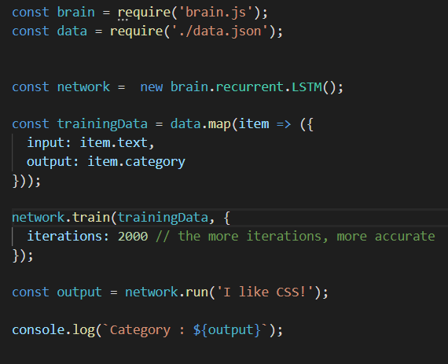

<h1 align="center">
  Machine learning With Javascript
</h1>

Basic machine learning and neural networks using [Brain.js](https://github.com/BrainJS/brain.js).

## 🚀 Quick start

1.  **To see data training result**
.
    ```shell
    # after cloning the repository 
    `node index` 
    `node index2.js`
    ```

## 🧐 What I tried?

1. **Probability of receiving number between 0 and 1**

A training data with number of 0 and 1. If there are many 1 than 0 in the inputs, there are high chances to get 1.



For example, 90% chance that output would be a 1 -> `const output = network.run([1, 0, 0])` <br/>

Low probability that output would be a 1 -> `const output = network.run([0, 0, 0])`<br/>

2.  **Probability of winning between two teams**



3.  **Training data to recognize piece of text or sentence**



Set the data with text and category in data.json, and I trained machine to recognize that data. <br/>

If I put text or sentence which closely relates to either of categories, the machine will determine which category is more close to the input and show you the output accordingly. 

## 🎓 Interesting Resources

- [Neural network in JavaScript](https://itnext.io/you-can-build-a-neural-network-in-javascript-even-if-you-dont-really-understand-neural-networks-e63e12713a3).
